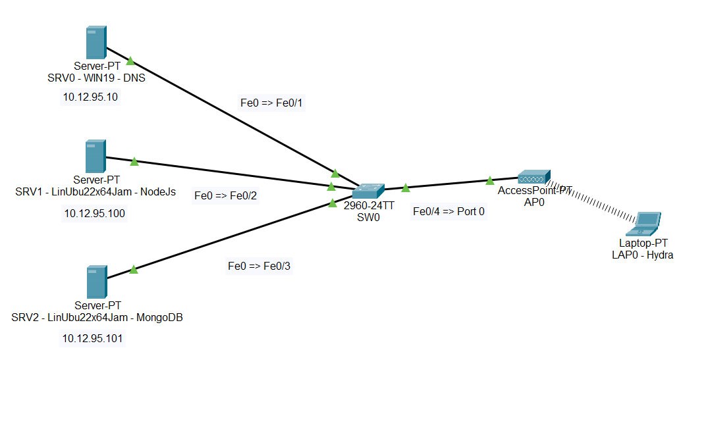

# Random Joke Rating Application

Dette er en webapplikasjon som viser tilfeldige vitser og lar brukere rangere dem. Applikasjonen henter vitser fra en ekstern API, lar brukeren gi en vurdering fra 1-5 stjerner, og viser gjennomsnittlige vurderinger for hver vits.

## Funksjonalitet

- Vise tilfeldige vitser med oppsett og punchline
- La brukere rangere vitser med 1-5 stjerner
- Vise gjennomsnittsvurderinger for hver vits
- Automatisk oppdatering av rangeringsinformasjon
- Responsivt design som fungerer på mobile enheter
- Beskyttelse mot overbelastning med rate limiting

## API-dokumentasjon

Applikasjonen har følgende API-endepunkter:

### `GET /api/joke`

Henter en tilfeldig vits.

**Response: (success(200))**
```json
{
  "id": "364",
  "setup": "A programmer puts two glasses on his bedside table before going to sleep.",
  "punchline": "A full one, in case he gets thirsty, and an empty one, in case he doesn’t."
}
```

**Response: (error(500))**
```json
{
  "error": "Kunne ikke hente vitsen"
}
```

### `POST /api/rate`

Registrerer en vurdering for en vits.

**Request:**
```json
{
  "jokeId": "364",
  "rating": 2
}
```

**Response: (success(201))**
```json
{
  "message": "Vurdering lagret",
  "average": "2.5",
  "count": 3
}
```

**Response: (error(400))**
```json
{
  "error": "Ugyldig vurdering"
}
```

### `GET /api/rating/:jokeId`

Henter gjennomsnittsvurdering for en bestemt vits.

**Response: (success(200))**
```json
{
  "average": "4.5",
  "count": 2
}
```

## Prosjektskisse



### Systemarkitektur
```
+----------------+      HTTP      +----------------+      +----------------+
|                |  Forespørsler  |                |      |                |
|   EJS Views    | ------------> |    Backend     | <--> |    Database    |
|   (Browser)    |   Responser    |   (Node.js)    |      |   (MongoDB)    |
|                | <------------ |                |      |                |
+----------------+               +----------------+      +----------------+
```

### Database-modeller

#### Model: Rating
- `jokeId`: String (unik identifikator for vitsen)
- `totalRating`: Number (summen av alle vurderinger)
- `ratingCount`: Number (antall vurderinger)
- `timestamps`: Date (createdAt og updatedAt)

### IP-plan
- **Backend:** 10.12.95.100/24
- **Database:** 10.12.95.101/24 (lukket nettverk)
- **DNS:** 10.12.95.10/24

## Sikkerhetsvurdering

### Implementerte sikkerhetstiltak

1. **Rate limiting**
   - Beskrivelse: Begrenser antall API-forespørsler fra samme IP-adresse.
   - Implementering: Express Rate Limit middleware med 5 forespørsel